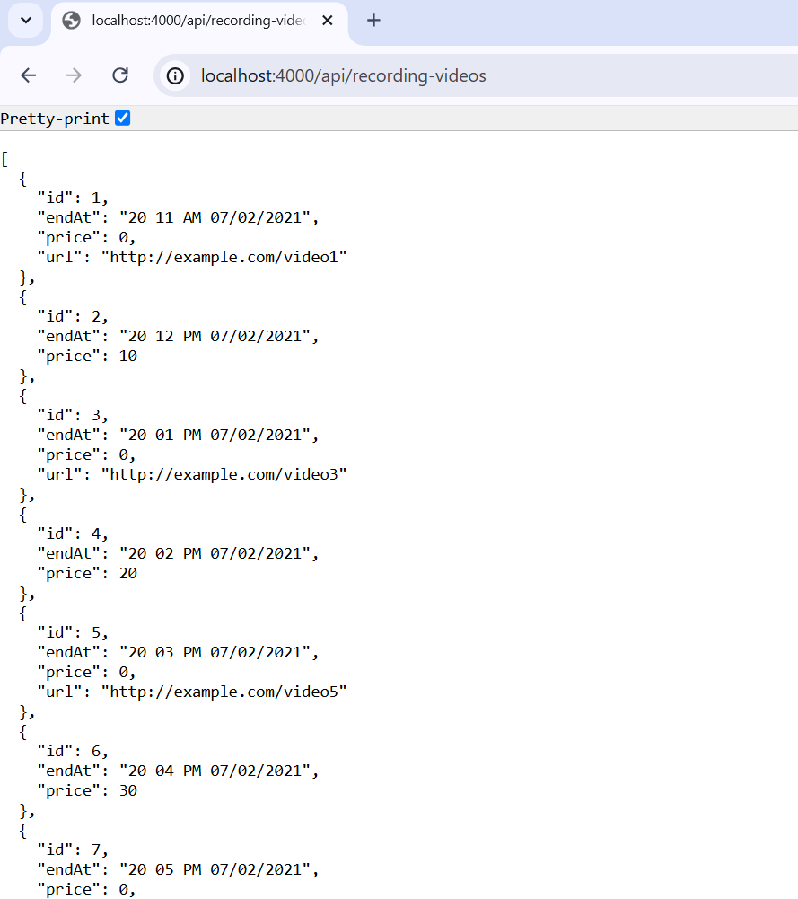

# NestJS Recording Video API

## Project Description

This NestJS project provides an API to process and retrieve recording video data. The project includes a service to process video data according to specific business rules and an endpoint to fetch the processed data.

## Screenshot



## Video

[Video](https://github.com/abolfazlbzgh/nestjs-recording-video-api/raw/main/video.mp4)

### Key Features

- Process `RecordingVideo` data with specific rules:
  - Sort videos by the `endAt` field.
  - Format the `endAt` field as `mm hh AM/PM MM/DD/YYYY`.
  - Exclude the `url` field if the `price` is greater than 0.
  - Exclude videos if `isRecordingStarted`, `isStartRecordingPending`, or `isStopRecordingPending` are true.
- Expose an endpoint to fetch the processed video data.
- Handle validation and error responses gracefully.

## Project Structure
```arduino
src/
├── recording-video/
│ ├── dto/
│ │ └── recording-video.dto.ts
│ ├── recording-video.controller.ts
│ ├── recording-video.module.ts
│ ├── recording-video.service.ts
│ └── validation.ts
├── app.module.ts
└── main.ts
```

### Files

- `dto/recording-video.dto.ts`: Defines the data transfer object (DTO) for recording video data.
- `recording-video.controller.ts`: Contains the controller logic for handling requests to the `/api/recording-videos` endpoint.
- `recording-video.service.ts`: Contains the service logic for processing the recording video data.
- `validation.ts`: Contains the validation logic for query parameters.

## Installation and Setup

### Prerequisites

- [Node.js](https://nodejs.org/en/download/) (v14 or higher)
- [NestJS CLI](https://docs.nestjs.com/cli/overview)

### Installation

1. Clone the repository:

   ```bash
   git clone https://github.com/abolfazlbzgh/nestjs-recording-video-api.git
   cd nestjs-recording-video-api
   ```

2. Install dependencies:
   ```bash
   npm install
   ```

### Running the Application

1. Start the NestJS application: 
   ```bash
   npm run start
   ```

2. The application will run on [http://localhost:4000](http://localhost:4000).

## Usage

### API Endpoint

### GET /api/recording-videos
Fetch the processed recording video data.

### Query Parameters

- isRecordingStarted (boolean): Indicates if recording has started.
- isStartRecordingPending (boolean): Indicates if starting recording is pending.
- isStopRecordingPending (boolean): Indicates if stopping recording is pending.
- videos (string): A JSON string representing an array of video objects.

### Example Request
```bash
curl "http://localhost:4000/api/recording-videos?isRecordingStarted=false&isStartRecordingPending=false&isStopRecordingPending=false&videos=[{\"endAt\":\"1625242800000\",\"price\":0,\"url\":\"http://example.com/video1\"},{\"endAt\":\"1625246400000\",\"price\":10,\"url\":\"http://example.com/video2\"}]"

```

### Example Response

```json
[
  { 
    "id": 1,
    "endAt": "20 11 AM 07/02/2021",
    "price": 0,
    "url": "http://example.com/video1"
  },
  {
    "id": 2,
    "endAt": "20 12 PM 07/02/2021",
    "price": 10,
    "url": null
  }
]
```


## Error Handling
The API returns appropriate error messages for invalid or missing query parameters:

- 400 Bad Request: Missing or invalid query parameters.
```json
{
  "statusCode": 400,
  "message": "Missing query parameter: [parameter_name]",
  "error": "Bad Request"
}
```
```json
{
  "statusCode": 400,
  "message": "Invalid query parameters or JSON format",
  "error": "Bad Request"
}
```
